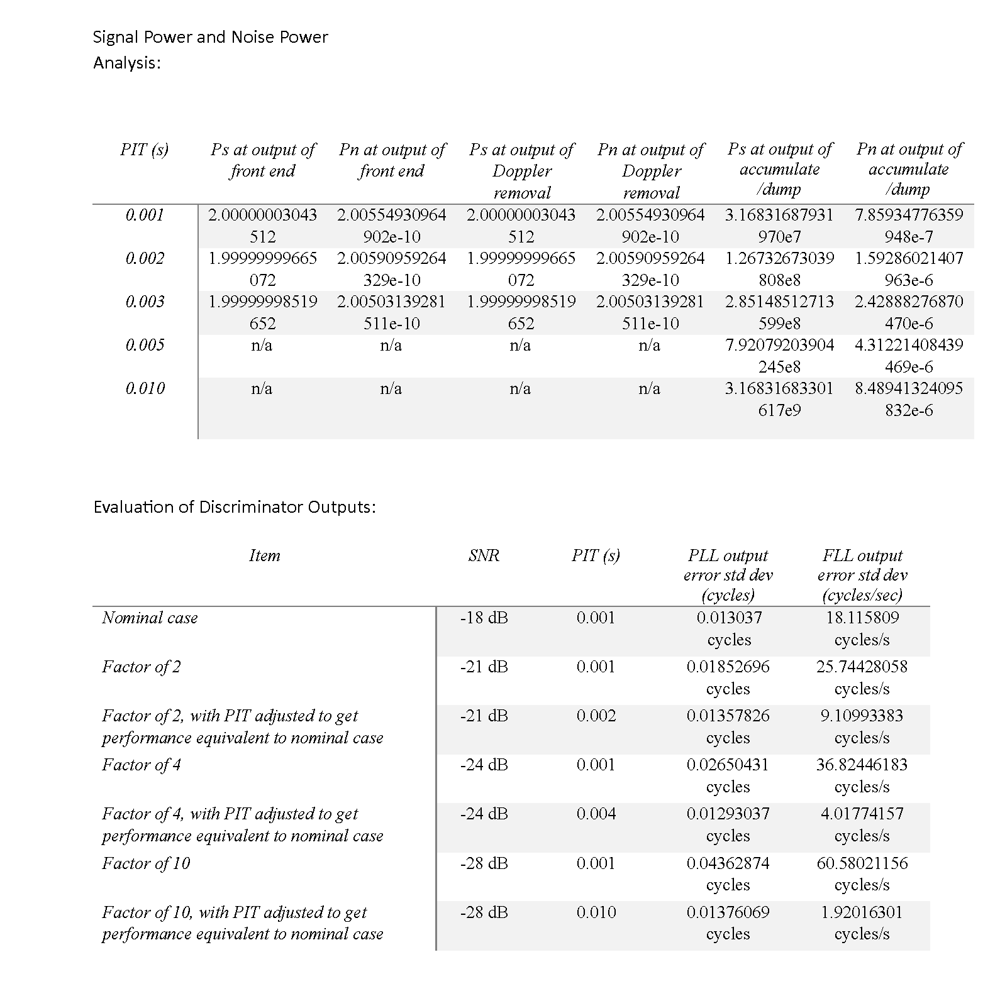

# GPS Receiver Carrier Tracking and Performance Analysis

## Overview

This project implements and evaluates the carrier tracking stage of a GPS receiver using MATLAB and Simulink.

The receiver architecture includes:

- Doppler Removal
- Integrate-and-Dump Accumulation
- Phase Locked Loop (PLL)
- Frequency Locked Loop (FLL)

## System Architecture

## Performance Results

## Objectives

- Implement carrier tracking loops for GNSS receivers
- Analyze signal and noise power
- Evaluate PLL and FLL discriminator performance
- Investigate the effect of integration time under different SNR conditions

## Software Tools

- MATLAB
- Simulink

## Repository Contents

- main.slx
- load_params.m
- Report.pdf

## Key Results

- Implemented PLL and FLL discriminators
- Performed signal and noise power analysis
- Evaluated tracking performance under multiple SNR scenarios
- Demonstrated the impact of integration time on receiver performance

## 👨‍💻 Author

**Alireza Ramyad**  
MSc Student in Communication Systems and Networks — Tampere University

## Topics

GNSS, GPS, Satellite Navigation, Carrier Tracking, PLL, FLL, Signal Processing, MATLAB, Simulink
